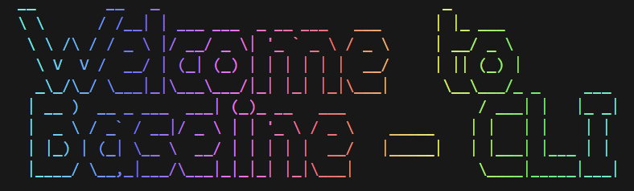

# baseline-check (blc)


Lightweight CLI to scan a project for used web platform features and report their Baseline status (via web-features) with line number precision.

## Quick start

- One-off (no install):

```powershell
npx baseline-check
```

- Install locally (dev):

```powershell
npm install --save-dev baseline-check
npx baseline-check
```

- Install globally:

```powershell
npm install -g baseline-check
baseline-check
```

## Usage examples

- Default (scan project, show risky items with line numbers):
  ```powershell
  npx baseline-check
  ```

- Show everything:
  ```powershell
  npx baseline-check --all
  ```

- Show newly available features:
  ```powershell
  npx baseline-check --new
  ```

- Summary only (summary implies --all):
  ```powershell
  npx baseline-check --summary
  ```

- Group by feature category:
  ```powershell
  npx baseline-check --group
  ```

- JSON output for tooling integration:
  ```powershell
  npx baseline-check --json
  ```

- Show features baseline since a specific date:
  ```powershell
  npx baseline-check --since 2023-01-01
  ```

- Scan specific files/globs:
  ```powershell
  npx baseline-check src/**/*.css
  ```

## Flags

- `--all`         Show all findings
- `--new`         Show newly available features  
- `--warnings`, `-w`  Show warnings + newly available
- `--summary`, `-s`   Print summary counts and score (implies --all)
- `--json`        Output in JSON format for tooling
- `--group`       Group findings by feature category (CSS, Grid, etc.)
- `--since DATE`  Show features baseline since date (YYYY-MM-DD format)
- `--limit N`     Limit printed items per file/group

## Features

- **Line-precise detection**: Shows exact line numbers where features are used
- **Multi-format support**: Scans CSS, HTML, JavaScript/TypeScript files
- **Inline code detection**: Finds features in inline styles and script tags
- **Feature grouping**: Organize results by web platform categories
- **Date filtering**: Track baseline adoption trends over time
- **JSON export**: Machine-readable output for IDE and tooling integration
- **Comprehensive coverage**: Uses web-features data and compute-baseline

## Output Examples

### Standard Report
```
File: src/styles.css
─────────────────────────────────────────────
Feature             Line Status      Support
─────────────────────────────────────────────
Grid                3    ✅ Widely    Baseline 2020-04-17
Subgrid             4    🟡 Newly     Baseline 2023-09-15
word-break: auto-p  10   ❌ Not in    chrome, chrome_android, edge
```

### Grouped Report (--group)
```
Group: Grid
─────────────────────────────────────────────
Feature             Line File            Status      Support
─────────────────────────────────────────────
Grid                3    styles.css      ✅ Widely    Baseline 2020-04-17
Subgrid             4    styles.css      🟡 Newly     Baseline 2023-09-15
```

## Notes

- CLI names: `blc` and `baseline-check` (both point to the same binary)
- The launcher strips a single `--` automatically, so both `npx . --summary` and `npx . -- --summary` work
- Scanner ignores `node_modules`, `dist`, and `.git` by default
- Set `BLC_DEBUG=1` to print the resolved args for debugging:

```powershell
$env:BLC_DEBUG=1; npx . --summary
```

## Publishing / testing

- Preview publish contents:

```powershell
npm pack --dry-run
npm publish --dry-run
```

- Dev/test files (e.g. `debug-bcd.js`, `debug-parse-css.js`, `test-sample.css`) are for local testing and should not be included in the published package. The `files` field in `package.json` restricts published files.

- Publish a patch (recommended flow):

```powershell
npm version patch -m "chore(release): %s"
npm publish --access public
git push && git push --tags
```

## License

ISC